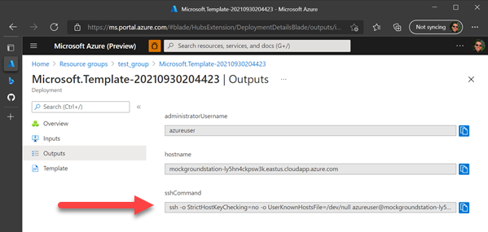
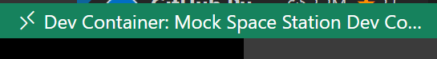
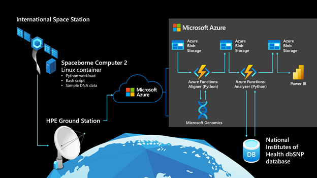

# mock-spacestation

## What is mock-spacestation?

mock-spacestation empowers developers and enthusiasts to create their own space-based applications with similar constraints to projects deployed to the International Space Station (ISS) by deploying a Mock Groundstation and Mock Spacestation to Azure via a [Bicep template](https://aka.ms/bicep) or on your local hardware with [Visual Studio Code Remote Dev Containers](https://code.visualstudio.com/docs/remote/create-dev-container).

The solutions in this repository were used by the Azure Space team during the development of their genomics experiment so that they could understand the challenges they'd face in network latency, container deployment, authentication, and machine configuration, while awaiting installation of the Hewlett Packard Enterprise (HPE) Spaceborne Computer 2 (SBC2) aboard the ISS.

For context, here's a video summary of that experiment conducted in August of 2021:

[](https://www.youtube.com/watch?v=wZfIUkcgVxI "Genomics testing on the ISS with HPE Spaceborne Computer-2 and Azure")

## What it simulates

1. **Processing at The Edge and "Bursting Down" to The Cloud:**

    The Azure Space team used computing power of the HPE SBC2 on-board the ISS to perform intensive work for their genomics experiment, identifying and transmitting just important information to Earth through the narrow 2 megabit per second pipe where it was further processed on a global scale with Azure.

1. **Latency:**

    There's tremendous latency communicating to an object in orbit and beyond. mock-spacestation simulates a ~400ms latency between the Mock Groundstation and Mock Spacestation to simulate the international hops and routing leveraged by the ISS

1. **Bandwidth:**

    2 mega*bits* per second to match the actual bandwidth cap when communicating with the ISS.

1. **Synchronization:**

    The solution in this repository synchornizes two directories every 60 seconds and are rate-limited by configurable bandwidth and latency constraints:

    - `./groundstation` is a directory for Mock Groundstation to send files to Mock Spacestation
    - `./spacestation` is a directory for Mock Spacestation to send files to Mock Groundstation

1. **Connectivity:**

    Just as with the ISS, there is no connectivity between the Mock Spacestation and The Internet.

    Earth to ISS connectivity is reserved to ~2 hours per week per experiment. This is **not** simulated in this solution, but should be a design consideration for your project.

## Deploy a Mock Groundstation

There are two ways in this repository to experience building an application with all the latency and disconnectedness of space:

1. [A virtual machine hosted in Azure](#Deploy-to-Azure)
1. [Using Docker containers on your local machine in Visual Studio Code](#Deploy-to-your-local-hardware)

### Deploy to Azure

All you'll need is an Azure Subscription to get started.

1. Deploy the Mock Groundstation and Mock Spacestation within a virtual machine on Azure:

    [](https://portal.azure.com/#create/Microsoft.Template/uri/https%3A%2F%2Fraw.githubusercontent.com%2Fazure%2Fmock-spacestation%2Fmain%2FAzureVM.json)

1. SSH into the Mock Groundstation virtual machine by executing the command from the Deployment output:

    

1. Accept the prompt with `yes` to add the virtual machine to your known hosts:

    ```plaintext
    Are you sure you want to continue connecting (yes/no/[fingerprint])? yes
    ```

1. Ensure provisioning succeeded

    Once you've SSH connected to the virtual machine, verify everything is configured correctly by inspecting a file we write called `./mockspacestation-provisioning.log`.

    Write it's output to the terminal with `cat`:

    ```bash
    cat ./mockspacestation-provisioning.log
    ```

    You should see a log that ends in **Mock SpaceStation Configuration (v2.0) Complete**:

    ```plaintext
    Starting Mock SpaceStation Configuration (v 2.0)
    -----------------------------------------------------------
    Mon Oct  4 20:59:26 UTC 2021: Working Dir: /
    Mon Oct  4 20:59:26 UTC 2021: Installing libraries
    Mon Oct  4 20:59:44 UTC 2021: Docker Setup Start
    Mon Oct  4 21:00:25 UTC 2021: Docker Setup Complete
    Mon Oct  4 21:00:25 UTC 2021: Ground Station OS Setup Start
    Mon Oct  4 21:00:26 UTC 2021: Ground Station OS Setup Complete
    Mon Oct  4 21:00:26 UTC 2021: Docker configuration Start
    Mon Oct  4 21:00:26 UTC 2021: Downloading Library Scripts Start
    Mon Oct  4 21:00:26 UTC 2021: Downloading Library Scripts Complete
    Mon Oct  4 21:00:26 UTC 2021: SpaceStation Container Build Start
    Mon Oct  4 21:04:24 UTC 2021: SpaceStation Container Build Complete
    Mon Oct  4 21:04:24 UTC 2021: SpaceStation Container Start
    Mon Oct  4 21:04:25 UTC 2021: SpaceStation Container Complete
    Mon Oct  4 21:04:26 UTC 2021: Docker configuration End
    -----------------------------------------------------------
    Mon Oct  4 21:04:26 UTC 2021: Mock SpaceStation Configuration (v 2.0) Complete.
    ```

    This could take a few minutes, especially at the `SpaceStation Container Build Start` step.

    If you do not see **Mock SpaceStation Configuration (v2.0) Complete** continue to `cat` the file until you see this message.

1. [Validate Mock Spacestion Connection](#Validate-Mock-Spacestation-Connection)

    Once the virtual machine has been deployed and the Mock Spacestation Configuration is compelte, get started synchronizing files and ensuring you can connect to the Mock Spacestation following the steps at:

    [Validate Mock Spacestion Connection](#Validate-Mock-Spacestation-Connection)

### Deploy to your local hardware

#### Local Prerequisites

Running the Mock Groundstation and Mock Spacestation locally requires you to install these prerequisites:

- [Visual Studio Code](https://code.visualstudio.com/Download)
- [The Remote Containers Extension](https://marketplace.visualstudio.com/items?itemName=ms-vscode-remote.remote-containers)
- [The Windows Subsystem for Linux (WSL2)](https://docs.microsoft.com/en-us/windows/wsl/install)
- [Docker Desktop](https://www.docker.com/products/docker-desktop)
- [Setup Docker to use WSL2](https://docs.microsoft.com/en-us/windows/wsl/tutorials/wsl-containers)

#### Start containers within Visual Studio Code

Once you have the prerequisites installed follow these steps to get started:

1. Clone this repository

    ```bash
    git clone https://github.com/Azure/mock-spacestation.git
    ```

1. Open Visual Studio Code from the repository

    First, change directories to the repository you just cloned:

    ```bash
    cd mock-spacestation
    ```

    Then open the folder with Visual Studio Code by executing `code .` (the period character is required):

    ```bash
    code .
    ```

1. Build the Mock Groundstation and Mock Spacestation

    From Visual Studio Code's Command Palette (F1) run the command: `Remote-Containers: Open Folder in Container...`

    After a few minutes, Visual Studio Code will re-open the repository inside of a container. You'll know it was successful when you see this in the lower-left corner of Visual Studio Code:

    

1. Open a terminal in the devcontainer

    You can use Visual Studio Code's toolbar > Terminal > New Terminal.

    Or, use the keyboard shortcut `` ctrl + ` ``

1. [Validate Mock Spacestion Connection](#Validate-Mock-Spacestation-Connection)

    Once the containers have been built, get started synchronizing files and ensuring you can connect to the Mock Spacestation following the steps at:

    [Validate Mock Spacestion Connection](#Validate-Mock-Spacestation-Connection)

1. Get started [writing your app](#Writing-your-app)

## Validate Mock Spacestation Connection

Whether you deployed the Mock Groundstation to Azure or have it running locally in Visual Studio Code, the scripts within this repository should automate everything you need to start synchronizing a Mock Groundstation to a Mock Spacestation.

1. Write a new message in the `/groundstation` directory

    The `/groundstation` directory is configured to synchronize to the Mock Spacestation with the latency experienced communicating with the ISS.

    Let's write a file to this directory so we can see it synchronized to the Mock Spacestation:

    ```bash
    echo "Hello! It is currently $(date) on the groundstation! Is anybody home?" >> groundstation/helloFromGroundstation.txt
    ```

1. Connect to the Mock Spacestation

    Now let's go see that file on the Mock Spacestation.

    Connect to the Mock Spacestation with the script at the root of the repository:

    ```bash
    ./ssh-to-spacestation.sh
    ```

1. Check the contents of `/groundstation`

    We should see that file we earlier authored on the Mock Groundstation in the `/groundstation` directory. Let's check it out:

    ```bash
    ls groundstation
    # helloFromGroundstation.txt
    ```

    and inside the file we should see our output:

    ```bash
    cat groundstation/helloFromGroundstation.txt
    # Hello! It is currently Mon Oct  4 16:20:10 EDT 2021 on the groundstation! Is anybody home?
    ```

1. Write a reply in the `/spacestation` directory:

    The `/spacestation` directory, too, is configured to synchronize to the Mock Groundstation with the latency experienced communicating with the ISS.

    Let's write a file to this directory so we can see it synchronized to the Mock Groundstation:

    ```bash
    echo "Hi there groundstation! It is currently $(date) on the spacestation! The weather is fine." >> spacestation/helloFromSpacestation.txt
    ```

1. Exit the Mock Spacestation to return to the Mock Groundstation

    Closing the SSH connection returns you to the Mock Groundstation.

    You can do this with the `exit` command:

    ```bash
    exit
    ```

    You'll see some message about being disconnected from a host:

    ```bash
    logout
    Connection to #.#.#.# closed.
    ```

1. Check the contents of `/spacestation`

    We should see that file we earlier authored on the Mock Spacestation in the `/spacestation` directory. Let's check it out:

    ```bash
    ls spacestation
    # helloFromSpacestation.txt
    ```

    and inside the file we should see our output:

    ```bash
    cat spacestation/helloFromSpacestation.txt
    # Hi there groundstation! It is currently Mon Oct  4 16:23:05 EDT 2021 on the spacestation! The weather is fine?
    ```

That's it! Any files you place in `/groundstation` will synchronize to `/groundstation` aboard the Mock Spacestation and files placed in `/spacestation` will synchronize to `/spacestation` on the Mock Groundstation!

## Writing your app

Containerize your app and mount the `/spacestation` directory to start synching app output and experiment results to the groundstation.

In the following steps we'll show you how you can run a dotnet application on the Mock Spacestation.

1. Clone and build the [dotnetapp sample](https://github.com/dotnet/dotnet-docker/tree/main/samples/dotnetapp):

    ```plaintext
    docker build --pull -t dotnetapp .
    ```

1. Save your docker image to a local file store:

    ```plaintext
    docker save --output ./dotnetsample-img.tar dotnetsample:latest
    ```

1. From Visual Studio Code's Terminal create a file `load-and-start.sh` to bootstrap your container run:

    ```bash
    touch load-and-start.sh
    ```

1. Add the docker commands you'll need to run the container to `load-and-start.sh`:

    Copy these contents into `load-and-start.sh`:

    ```bash
    #!/usr/bin/env bash
    docker load --input ./dotnetsample-img.tar
    docker run -d dotnetsample:latest --volume=/home/azureuser/spacestation:/spacestation Hello .NET from spacestation.
    ```

1. Execute `load-and-start.sh` from the Visual Studio Code Terminal:

    ```bash
    ./load-and-start.sh
    ```

1. Anything your app writes to `/spacestation` will be replicated to `/groundstation`

## An Example "Burst Down" Workload

The Azure Space team's genomics experiment is an example of a solution you could build with these mock-spacestation components:

]

More technical information on the experiment can be found at this blog post: [https://azure.microsoft.com/en-us/blog/genomics-testing-on-the-iss-with-hpe-spaceborne-computer2-and-azure/](https://azure.microsoft.com/en-us/blog/genomics-testing-on-the-iss-with-hpe-spaceborne-computer2-and-azure/)

### On the Spacestation

- A Linux container hosts a Python workload, which is packaged with data representing mutated DNA fragments and wild-type (meaning normal or non-mutated) human DNA segments. There are 80 lines of Python code, with a 30-line bash script to execute the experiment.

- The Python workload generates a configurable amount of DNA sequences (mimicking gene sequencer reads, about 70 nucleotides long) from the mutated DNA fragment.

- The Python workload uses awk and grep to compare generated reads against the wild-type human genome segments.

- If a perfect match cannot be found for a read, it’s assumed to be a potential mutation and is compressed into an output folder on the Spaceborne Computer-2 network-attached storage device.
After the Python workload completes, the compressed output folder is sent to the HPE groundstation on Earth via rsync.

### On Earth

- The HPE groundstation uploads the data it receives to Azure, writing it to Azure Blob Storage through azcopy.

- An event-driven, serverless function written in Python and hosted in Azure Functions monitors Blob Storage, retrieving newly received data and sending it to the Microsoft Genomics service via its REST API.

- The Microsoft Genomics service, hosted on Azure, invokes a gene sequencing pipeline to “align” each read and determine where, how well, and how unambiguously it matches the full reference human genome. (The Microsoft Genomics service is a cloud implementation of the open-source Burroughs-Wheeler Aligner and Genome Analysis Toolkit, which Microsoft tuned for the cloud.)

- Aligned reads are written back to Blob Storage in Variant Call Format (VCF), a standard for describing variations from a reference genome.

- A second serverless function hosted in Azure Functions retrieves the VCF records, using the determined location of each mutation to query the dbSNP database hosted by the National Institute of Health—as needed to determine the clinical significance of the mutation—and writes that information to a JSON file in Blob Storage.

- Power BI retrieves the data containing clinical significance of the mutated genes from Blob Storage and displays it in an easily explorable format.
