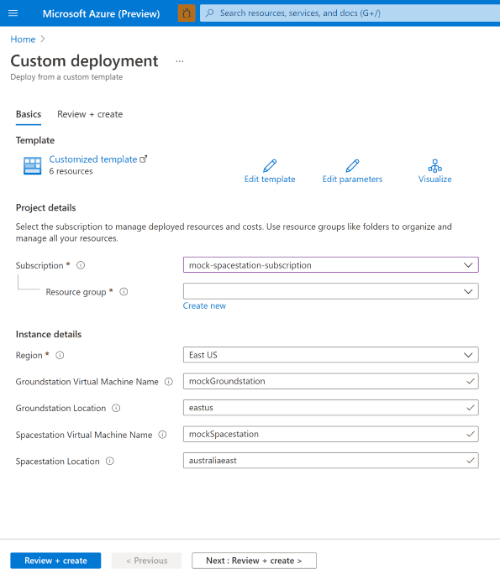
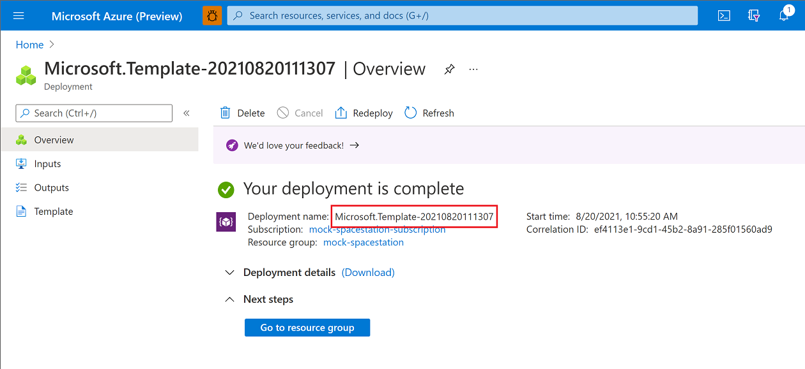
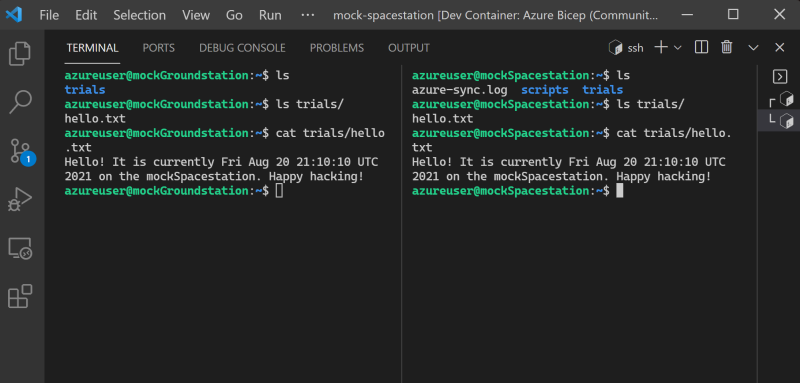
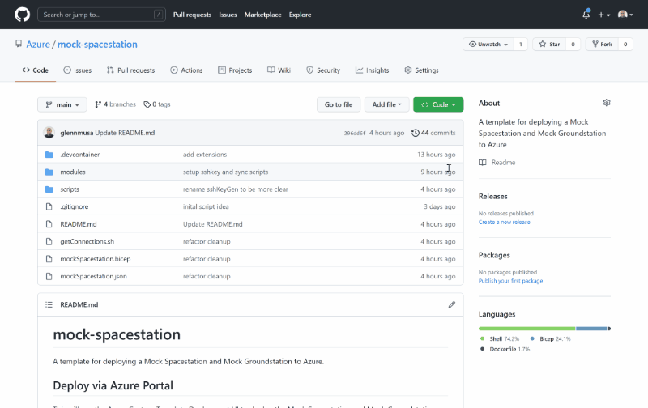

# mock-spacestation

## What is mock-spacestation?

mock-spacestation is a [Bicep template](https://aka.ms/bicep) that deploys a Mock Spacestation and Mock Groundstation to Azure to enable developers and enthusiasts to develop and test their own workloads for space with similar constraints to those seen working with the International Space Station (ISS).

The Mock Groundstation and Mock Spacestation virtual machines deployed by this template are how the Azure Space team developed and tested their experiment workload while preparing for the installation of the Hewlett Packard Enterprise (HPE) Spaceborne Computer 2 (SBC2) aboard the ISS.

[](https://portal.azure.com/#create/Microsoft.Template/uri/https%3A%2F%2Fraw.githubusercontent.com%2FAzure%2Fmock-spacestation%2Fmain%2FmockSpacestation.json)

For context, here's a video summary of that experiment executed in August of 2021:

[](https://www.youtube.com/watch?v=wZfIUkcgVxI "Genomics testing on the ISS with HPE Spaceborne Computer-2 and Azure")

## What it simulates

1. **Latency**

    The Mock Groundstation is located in East US and the Mock Spacestation is located in Australia to simulate the speed of light latency and many international hops that communication with the ISS traverses.

2. **Bandwidth**

    The Mock Spacestation is configured out of the box to synchronize with the Mock Groundstation at the actual bandwidth cap when communicating with the ISS: 2 *megabits* per second.

3. **Processing at The Edge and "Bursting Down" to The Cloud**

    When the Azure Space team performed their genomics experiment, they used computing power of the HPE SBC2 on-board the ISS to perform intensive work at the edge to determine what is important enough to send back to Earth, then transmitted just those important bits through the narrow 2 megabit per second pipe, then scaled up analysis and compute on a global scale with Azure.

## Get started with mock-spacestation

To get started developing your workload for space:

1. First, you'll **[deploy the Mock Spacestation template](#Deploy-the-Template)**

2. Then, you'll execute a small script to **[get the ssh commands to connect](#Connect-to-the-VMs)** to your Mock Spacestation and Mock Groundstation and **[see the `/trials/` directory synched](#Synchronize-Directories)** between the two with all the bandwidth and latency configured into the deployment

You'll need the Azure CLI and the ability to invoke a BASH script to retrieve the SSH key to connect to the Mock Spacestation and Mock Groundstation. If you're on a host that doesn't have those things, or you're not quite sure, you can pretty quickly and easily [use our developer environment](#Using-our-Development-Environment).

## Deploy the Template

You have two options for deploying mock-spacestation:

1. A command-line deployment [via the Azure CLI](#via-Azure-CLI)

2. A user-interface deployment [via the Azure Portal](#via-Azure-Portal)

### via Azure CLI

If you're comfortable with the command line, the Azure CLI provides the `deployment` command group to deploy the Mock Spacestation and Mock Groundstation.

1. First, ensure you're logged into the Azure CLI and have set the subscription you want to deploy into: 

    ```plaintext
    az login
    az account set --subscription <subscription name or ID> 
    ```

    Here's a link to the documentation if you need more help logging in: [https://docs.microsoft.com/en-us/cli/azure/reference-index?view=azure-cli-latest#az_login](https://docs.microsoft.com/en-us/cli/azure/reference-index?view=azure-cli-latest#az_login)

2. Next, set yourself some environment variables to make things easier `resourceGroupName` and `deploymentName`:

    ```bash
    resourceGroupName="mock-spacestation"
    deploymentName="mock-spacestation-deploy"
    ```

3. Then, create a resource group with `az group create`:

    ```bash
    az group create \
      --location eastus \
      --name $resourceGroupName
    ```

4. And then you can deploy the Mock Spacestation and Mock Groundstation into that resource group with `az deployment group create`:

    ```bash
    az deployment group create \
      --resource-group $resourceGroupName \
      --name $deploymentName \
      --template-file ./mockSpacestation.json
    ```

5. Once that's complete move on to [Connect to the VMs](#Connect-to-the-VMs)

### via Azure Portal

We can deploy the Mock Spacestation and Mock Groundstation to Azure from the portal with just a few clicks.

When you deploy with the "Deploy to Azure" button below, create yourself a new resource group:



**Make note of the name of the Resource Group you create and the name of the Deployment that gets generated for you. You'll need those to get your SSH credentials**.

(The generated name is usually something similar to "Microsoft.Template-${timestamp}" like "Microsoft.Template-20210820123456")



1. Deploy mock-spacestation into a new resource group:

    [](https://portal.azure.com/#create/Microsoft.Template/uri/https%3A%2F%2Fraw.githubusercontent.com%2FAzure%2Fmock-spacestation%2Fmain%2FmockSpacestation.json)

2. Once that's complete, move on to [Connect to the VMs](#Connect-to-the-VMs)

## Connect to the VMs

After you've deployed the Mock Spacestation template, use [./getConnections.sh](./getConnections.sh) to get connected to the Mock Groundstation and Mock Spacestation.

1. Invoke `getConnections.sh` and pass it the name of your resource group and the name of the deployment:

    ```bash
    ./getConnections.sh $resourceGroupName $deploymentName
    ```

2. `getConnections.sh` will place the private key on your machine and present you with your SSH commands to the Groundstation and Spacestation:

    ```plaintext
    INFO: Success! Private key written to ./mockSpacestationPrivateKey. Run these commands to SSH into your machines...
    ssh -i mockSpacestationPrivateKey azureuser@mockgroundstation-abcd1234efgh5.eastus.cloudapp.azure.com
    ssh -i mockSpacestationPrivateKey azureuser@mockspacestation-abcd1234efgh5.australiaeast.cloudapp.azure.com
    ```

## Synchronize Directories

Once you're connected to the Spacestation, **any files or directories that make their way to the `/home/azureuser/trials` directory will be synched to the same directory on the Groundstation at a rate of 2 megabits per second every minute**.

This scheduled synchronization recreates the time delay and limited bandwidth environment of a real-world experiment executed on the ISS.



1. Place a file or directory in `/home/azureuser/trials`:

    ```bash
    # on the Mock Spacestation
    echo "Hello! It is currently $(date) on the mockSpacestation! Happy Hacking!" >> /home/azureuser/trials/hello.txt
    ```

2. And within a minute or so, on the Mock Groundstation, you should see that file in the same directory:

    ```bash
    # now on the Mock Groundstation
    cd /home/azureuser/trials
    cat hello.txt
    Hello! It is currently Fri Aug 20 21:10:10 UTC 2021 on the mockSpacestation! Happy Hacking!
    ```

3. On the Mock Spacestation, you can inspect the contents of `azure-sync.log` to see file and directory transmission history and transfer speeds:

    ```bash
    # back on the Mock Spacestation
    cat /home/azureuser/azure-sync.log
    ```

4. Which yields output from `rsync` operations like:

    ```plaintext
    sent 177 bytes  received 66 bytes  44.18 bytes/sec
    total size is 92  speedup is 0.38
    opening connection using: ssh -i /home/azureuser/.ssh/mockSpacestationPrivateKey -l azureuser mockgroundstation-abcd1234efgh5.eastus.cloudapp.azure.com rsync --server -vvlogDtprze.iLsfxC --bwlimit=250 . /home/azureuser/trials  (12 args)
    sending incremental file list
    delta-transmission enabled
    hello.txt is uptodate
    total: matches=0  hash_hits=0  false_alarms=0 data=0
    ```

**Happy hacking!** Continue reading on for more information about how we built the Genomics experiment on Azure using the HPE SBC2 and the ISS, or how we setup our developer machines with containers to collaborate.

## An Example "Burst Down" Workload

The Azure Space team's genomics experiment is an example of a solution you could build with these mock-spacestation components:

]

More technical information on the experiment can be found at this blog post: [https://azure.microsoft.com/en-us/blog/genomics-testing-on-the-iss-with-hpe-spaceborne-computer2-and-azure/](https://azure.microsoft.com/en-us/blog/genomics-testing-on-the-iss-with-hpe-spaceborne-computer2-and-azure/)

### On the Spacestation

- A Linux container hosts a Python workload, which is packaged with data representing mutated DNA fragments and wild-type (meaning normal or non-mutated) human DNA segments. There are 80 lines of Python code, with a 30-line bash script to execute the experiment.

- The Python workload generates a configurable amount of DNA sequences (mimicking gene sequencer reads, about 70 nucleotides long) from the mutated DNA fragment.

- The Python workload uses awk and grep to compare generated reads against the wild-type human genome segments.

- If a perfect match cannot be found for a read, it’s assumed to be a potential mutation and is compressed into an output folder on the Spaceborne Computer-2 network-attached storage device.
After the Python workload completes, the compressed output folder is sent to the HPE ground station on Earth via rsync.

### On Earth

- The HPE ground station uploads the data it receives to Azure, writing it to Azure Blob Storage through azcopy.

- An event-driven, serverless function written in Python and hosted in Azure Functions monitors Blob Storage, retrieving newly received data and sending it to the Microsoft Genomics service via its REST API.

- The Microsoft Genomics service, hosted on Azure, invokes a gene sequencing pipeline to “align” each read and determine where, how well, and how unambiguously it matches the full reference human genome. (The Microsoft Genomics service is a cloud implementation of the open-source Burroughs-Wheeler Aligner and Genome Analysis Toolkit, which Microsoft tuned for the cloud.)

- Aligned reads are written back to Blob Storage in Variant Call Format (VCF), a standard for describing variations from a reference genome.

- A second serverless function hosted in Azure Functions retrieves the VCF records, using the determined location of each mutation to query the dbSNP database hosted by the National Institute of Health—as needed to determine the clinical significance of the mutation—and writes that information to a JSON file in Blob Storage.

- Power BI retrieves the data containing clinical significance of the mutated genes from Blob Storage and displays it in an easily explorable format.

## Using our Development Environment

Whether you're on Windows or Linux or otherwise, it's pretty handy to use a [container described in the repository](./devcontainer/Dockerfile) as your development environment.

Our environment comes with all the tools we used to author this repo so it's where we can best ensure compatibility (plus, we just think it's pretty cool to have our developer machines ready to go with all the tools we need in seconds).

It's really easy to get started with GitHub Codespaces and/or Visual Studio Code.

### GitHub Codespaces

If you or your organization uses Codespaces, it's remarkably easy to use our development environment. Just click the green `Code` icon on the main page of this repository and select `New Codespace`:



What are Codespaces? Get more information here: [https://docs.github.com/en/codespaces](https://docs.github.com/en/codespaces)

### Visual Studio Code Remote - Containers

It's also easy to use our development environment with Visual Studio Code and the Remote - Containers extension:


What is the Visual Studio Code Remote - Containers extension? Get installation steps and more information here: [https://marketplace.visualstudio.com/items?itemName=ms-vscode-remote.remote-containers](https://marketplace.visualstudio.com/items?itemName=ms-vscode-remote.remote-containers)

### Manually connecting to the Spacestation and Groundstation

You can also get configured to SSH into the Spacestation and Groundstation manually: [docs/manually-get-ssh-key.md](docs/manually-get-ssh-key.md)
