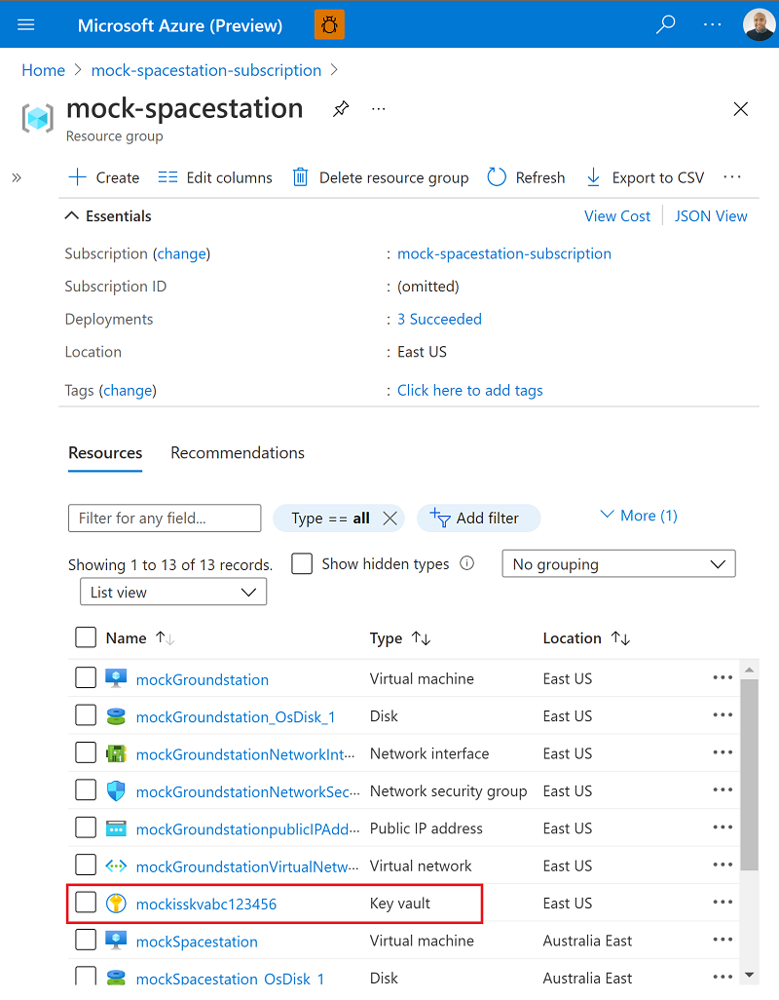
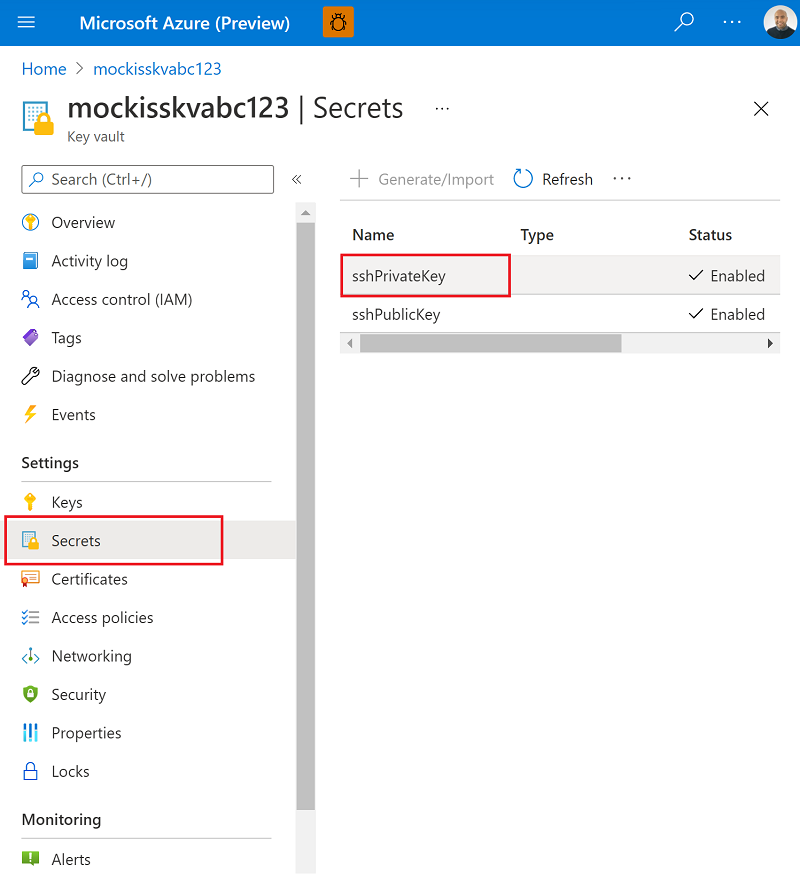
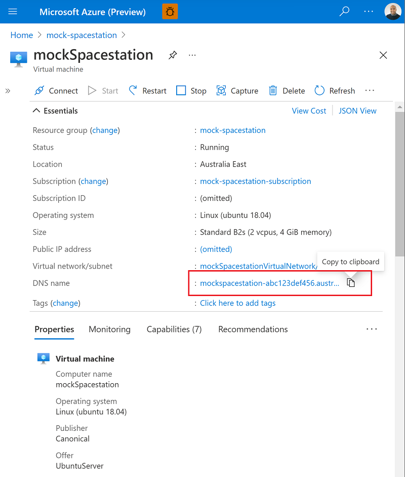

# Manually Get SSH Key

If you've [deployed mock-spacestation via the Azure Portal or the Azure CLI](../README.md#Deploy-the-Template) and don't have the tools available to run `getConnections.sh` and don't wish to use our development environment, you can manually retrieve the private key for SSH'ing into the Mock Groundstation and Mock Spacestation that is seeded in the KeyVault that was created as part of the deployment by granting yourself a Secrets Management Access Policy.

1. Find the Resource Group you deployed into and select the KeyVault resource:

    

2. In that KeyVault resource, assign yourself the Secret Management policy as documented here:

    [https://docs.microsoft.com/en-us/azure/key-vault/general/assign-access-policy-portal](https://docs.microsoft.com/en-us/azure/key-vault/general/assign-access-policy-portal)

3. Navigate to 'Secrets' to retrieve the SSH private key and save it to a local file

    

4. Use your preferred SSH client to connect to the virtual machines with `azureuser` and the FQDN for the machine:

    

5. Use the SSH private key you downloaded to SSH to the machine:

    ```bash
    ssh -i ./thePrivateKeyDownloadedFromKeyVault azureuser@mockspacestation-abc123def456.australiaeast.cloudapp.azure.com
    ```

6. Some links to popular SSH clients:

    - Ubuntu: https://help.ubuntu.com/community/SSH?action=show&redirect=SSHHowto
    - PowerShell: https://docs.microsoft.com/en-us/windows-server/administration/openssh/openssh_install_firstuse#install-openssh-using-powershell
    - Windows Terminal: https://docs.microsoft.com/en-us/windows/terminal/tutorials/ssh
